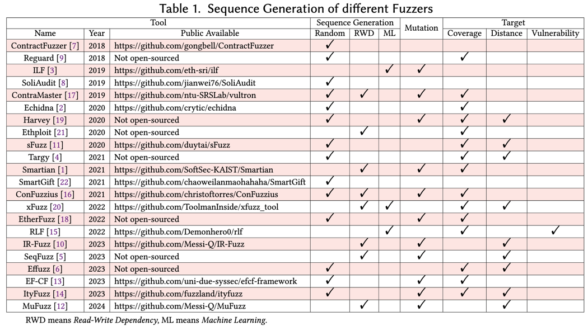

# Vulnerabilities
Anonymous Public Vulnerability

## Survey on Sequence Generation

Through our research, 
we summarize the current advanced 22 smart contract fuzzers based on our classification of Random and RWD methods, 
along with their mutation strategies for sequences and seed parameters. 
The findings are presented in follow. 
We observe that most fuzzers predominantly employ RWD techniques.

## Real-World Vulnerability

In following, we present the names and corresponding addresses of 
146 real-world on-chain contract projects from which we extracted data, 
including 19 contract projects that collectively exhibit 37 different vulnerabilities, 
whereas other state-of-the-art tools could only identify 13 and 15 vulnerabilities.

Since most contract teams could not be directly contacted, 
we have publicly documented all identified vulnerabilities here, 
and we are currently in the process of applying for CVE identifiers.

| Project Name | Address | Num | Vulnerability Type |
| --- | --- | --- | --- |
| Enumivo | 0x28f9b9aa3b885d67abb298491bbba65171c3392e | 1 | GL |
| FiatTokenProxy | 0x0BFFDD787C83235f6F0afa0Faed42061a4619B7a | 5 | DG, GL, IO, RE, UC |
| HBTC | 0x26c50AF4725a77172A60439EC1957252F2Fe4094 | 4 | GL, IO, RE, UE |
| PGETAlgorithm | 0x8e54572366d689c6502c88a95d395383edf08e16 | 1 | IO |
| QKCToken | 0xdebeddbbf635d92b2c1e714f587d30ac7b1c1d51 | 1 | IO |
| QKCToken | 0x738C400dD7CA164A0C551ec5c711D376B86f8E57 | 1 | IO |
| QKCToken | 0xF3BdECf96f810A7e6Fa7140EBEC146A6D6731447 | 1 | IO |
| QKCToken | 0xACB86779718b20b81f690145f75B91EaA8CC7E19 | 1 | IO |
| QKCToken | 0x563a5BEFc32A76cFB30899eE1e469fb7bc69c292 | 1 | IO |
| ShibaExpress | 0xcd327BfB5eEb8ded6ba628A2b9E7A3492446e840 | 1 | IO |
| ZeldaToken | 0x3d7cf99daf9FAcc7e40C9F5AFE318eB9aEB264E0 | 3 | GL, IO, RE |
| CardToken | 0x648445e48093d999966375b30186D433fEF9c364 | 1 | IO |
| GuessNumber | 0xe61f16c019bafea570dfa56ab996da5b5648856b | 1 | TP |
| HarrisToken | 0x26dbe633dec8e95bb885529d540277ac4fdcb6e5 | 1 | UE |
| PEW | 0xa3ff9ea688b782888678bc22b6dc66f56e50a1cc | 3 | GL, IO, RE |
| TetherToken | 0x595F693462c2241D2CFD68d8d3F70Cf3bbD82Bd3 | 1 | TP |
| TOKEN | 0x0653e11b1674958704be64f78c2701ec814e4677 | 4 | GL, IO, RE, TP |
| Latinum | 0xA269b43E9af00D7609730514a4044fc896aCEd8E | 3 | GL, IO, RE |
| MickeyMouse | 0x49d761E8e29008F0cDFb9c73A61093670257E132 | 3 | GL, IO, RE |

In Oracle setting, 
GL: Gasless, 
IO: Integer Over-/under-flow, 
RE: Reentrancy, 
UC: Unchecked Call, 
BN: Block Number Dependency, 
TP: Timestamp Dependency, 
DG: Dangerous Delegatecall, 
UE: Unexpected Ether or Ether Frozen.

