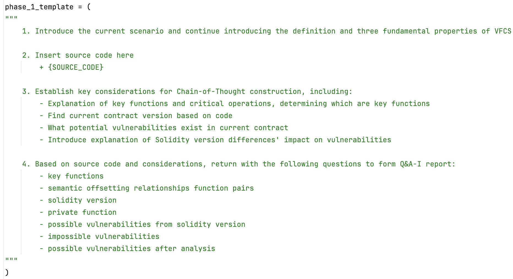
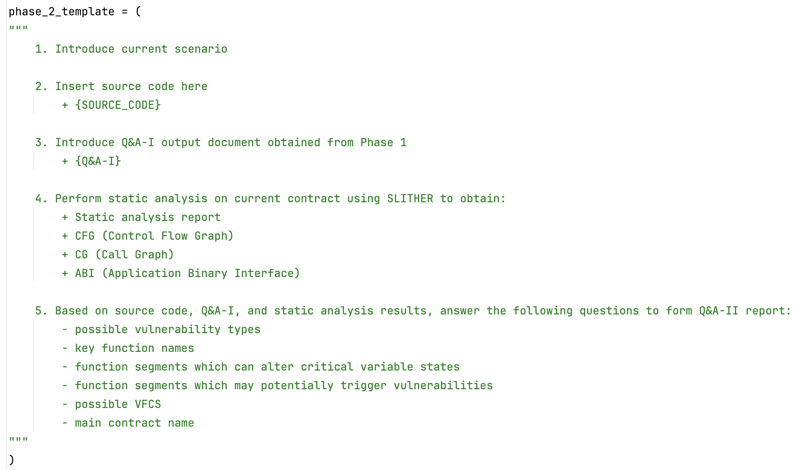
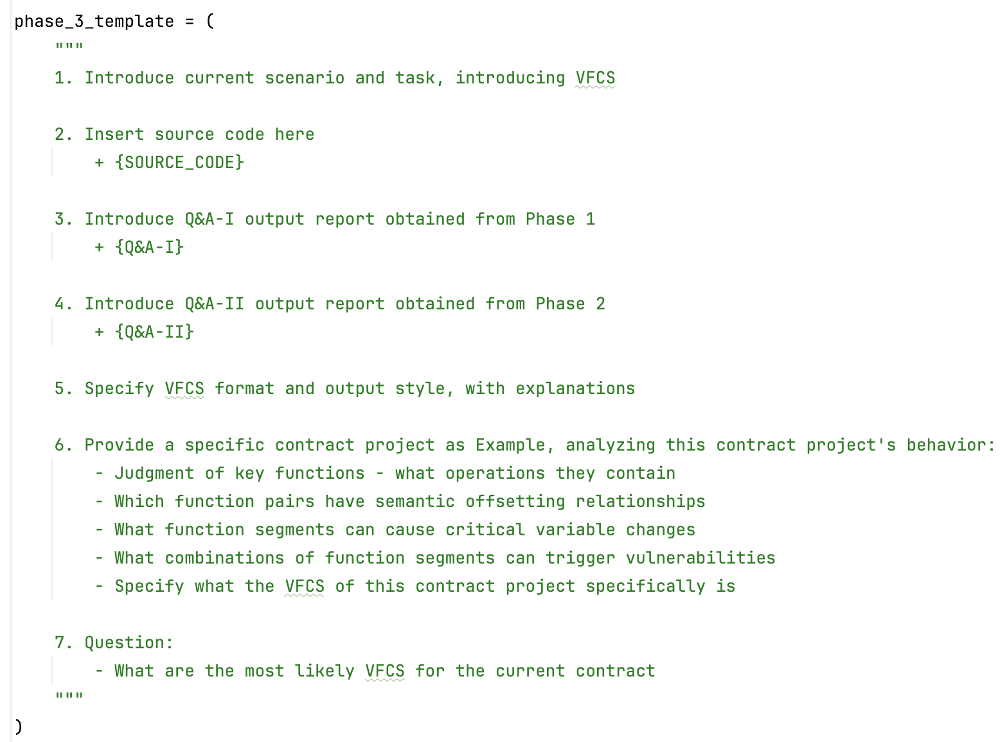
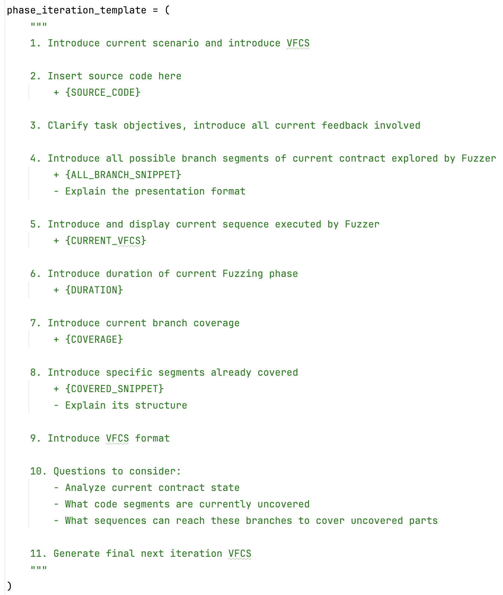

## For more easy to read

### For Step 1:

Template-I (Semantic Parsing) - As shown in the Figure, this template guides the LLM to first understand VFCS definition and properties, then analyze the contract source code through structured chain-of-thought considerations, and finally generate a systematic Q&A-I report covering critical functions and semantic relationships.

### For Step 2:

Template-II (Static Validation) - As shown in the figure, this prompt and template builds upon the semantic analysis from Step 1. It integrates the Q&A-I output with static analysis results from Slither. The template then guides the LLM to synthesize these inputs and generate a Q&A-II report. This process uses the deterministic information from static analysis to verify and refine the insights from Q&A-I, reducing LLM hallucinations while identifying concrete function segments. Through this verification, the step produces reliable function segments that can alter critical variable states, exhibit offsetting relationships, and potentially trigger vulnerabilities.

### For Step 3:

Template-III (VFCS Generation) - This template synthesizes previous analysis by integrating Q&A-I and Q&A-II reports with contract source code. It specifies the VFCS format and output requirements, then provides a concrete contract example demonstrating the analysis process. Following this demonstrated process, the template guides the LLM to generate the most likely VFCS candidates by combining semantic understanding from Step 1 and technical analysis from Step 2, transforming accumulated insights into concrete function call sequences that aim to semantically approximate the essential properties defined in Section 4.1.

### For Section 4.3:

Template IV (Iterative Refinement) - This template provides comprehensive real-time fuzzing feedback to the LLM, including current branch coverage, already covered segments, current sequence execution, and fuzzing duration. It clarifies the task objectives by presenting all available branch segments and explaining their structure. The template then guides the LLM to analyze the current contract state, identify uncovered code segments, and determine what sequences can reach these branches to cover unexplored parts. This iterative process enables the LLM to generate targeted next-iteration VFCS based on actual fuzzing results rather than theoretical analysis. By leveraging real-time feedback, this step overcomes fuzzing bottlenecks and directs exploration toward previously unreachable branches, ensuring continuous improvement in coverage and vulnerability discovery.

